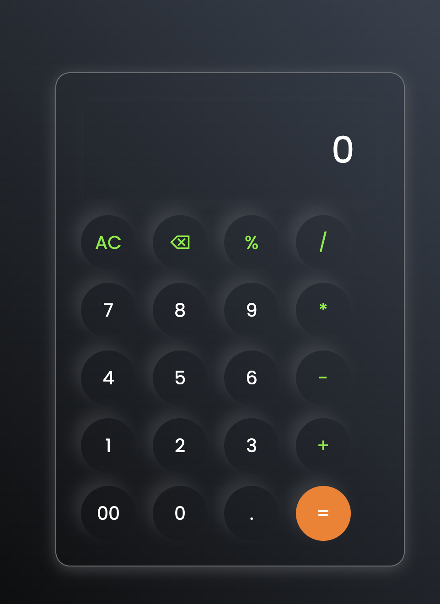

# 🧮 Calculator

A clean, modern web-based calculator built with vanilla HTML, CSS, and JavaScript. Features a sleek dark UI with glassmorphism-style design.



---

## ✨ Features

- Basic arithmetic operations: Addition, Subtraction, Multiplication, Division
- Percentage calculation (`%`)
- Decimal point support (`.`)
- Double zero input (`00`) for fast number entry
- All Clear (`AC`) to reset the display
- Backspace (`⌫`) to delete the last character
- Real-time expression display as you type
- Responsive, centered layout that works on all screen sizes

---

## 🛠️ Tech Stack

| Technology | Purpose |
|------------|---------|
| HTML5 | Structure and layout |
| CSS3 | Styling, gradients, glassmorphism |
| JavaScript (Vanilla) | Button logic and expression evaluation |
| Google Fonts (Poppins) | Clean, modern typography |

---

## 📁 Project Structure

```
Calculator/
├── index.html      # Main HTML file with calculator layout
├── style.css       # All styling — dark theme, button design, layout
├── script.js       # Button click logic and expression evaluation
└── sample.png      # Screenshot / preview image
```

---

## 🚀 How to Run

No installation or setup needed!

1. **Clone or download** this repository
2. **Open `index.html`** in any modern web browser
3. Start calculating!

```bash
# Optional: Clone via git
git clone https://github.com/your-username/calculator.git
cd calculator
```

---

## 🖥️ How It Works

### HTML (`index.html`)
Defines the calculator layout — an input box for display and buttons arranged in rows using `<div>` containers.

### CSS (`style.css`)
- Dark gradient background (`#0a0a0a` to `#3a4452`)
- Circular buttons with subtle shadow for a 3D effect
- Operators are highlighted in green (`#6dee0a`)
- The `=` button is highlighted in orange (`#fb7c14`)

### JavaScript (`script.js`)
- Selects all buttons and attaches a `click` event listener to each
- Builds a string expression as buttons are pressed
- `=` → evaluates the expression using `eval()`
- `AC` → clears the display
- `⌫` → removes the last character using `substring()`
- All other buttons → append their value to the expression string
- 
---

## 🔮 Future Improvements

- [ ] Keyboard support (type numbers directly)
- [ ] Scientific calculator mode (sin, cos, log, etc.)
- [ ] Calculation history panel
- [ ] Theme toggle (light / dark)
- [ ] Error handling for invalid expressions (e.g., `5//2`)

---


## 👤 Author

**Mahfooz Alam**  
B.Tech Computer Science | Parul University  
